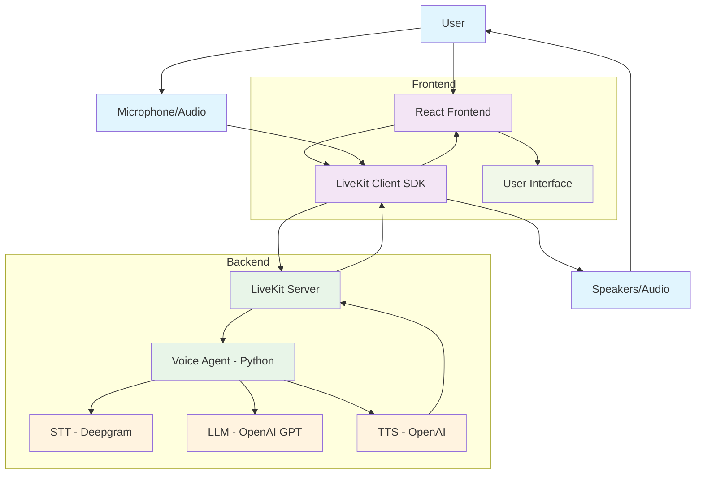

# Voice AI Conversational Agent Architecture

## Component Descriptions

1. **User**: Interacts with the system through voice and UI
2. **React Frontend**: Web interface built with React and Vite
3. **LiveKit Client SDK**: Handles real-time audio streaming in the browser
4. **LiveKit Server**: Manages WebRTC connections and media routing
5. **Voice Agent**: Python service that orchestrates the voice pipeline
6. **STT (Deepgram)**: Converts speech to text
7. **LLM (OpenAI GPT)**: Generates conversational responses
8. **TTS (OpenAI)**: Converts text to speech
9. **User Interface**: Displays conversation transcript
10. **Microphone/Audio**: Audio input device
11. **Speakers/Audio**: Audio output device

## Data Flow

1. User speaks into microphone
2. Audio captured by React frontend
3. Audio streamed to LiveKit Server via WebRTC
4. Voice Agent receives audio stream
5. STT converts audio to text
6. LLM generates response based on conversation history
7. TTS converts response text to audio
8. Audio streamed back through LiveKit Server
9. Frontend plays audio through speakers
10. Transcript displayed in UI